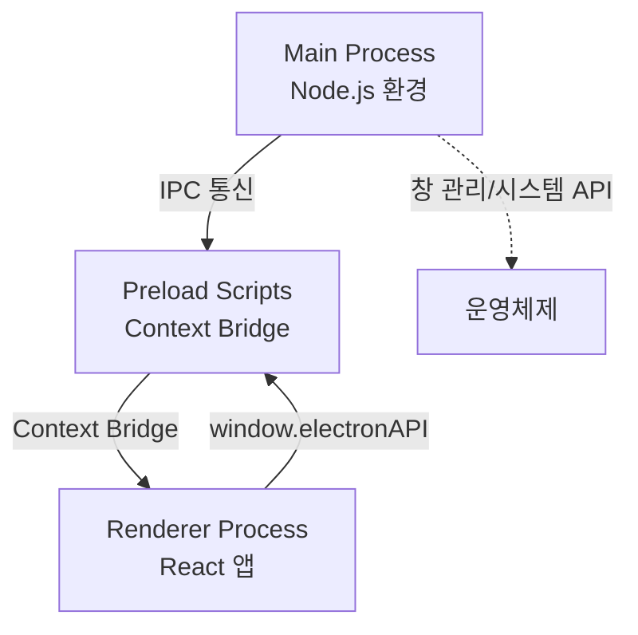
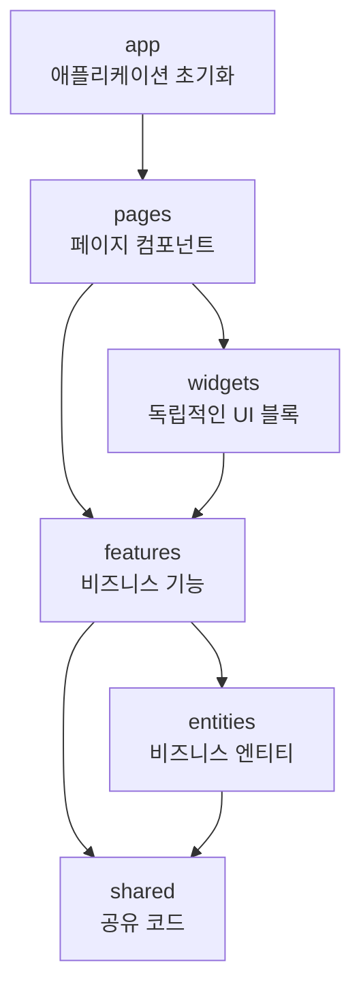
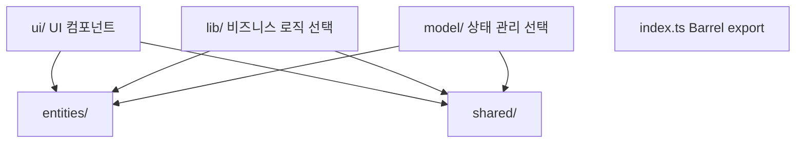
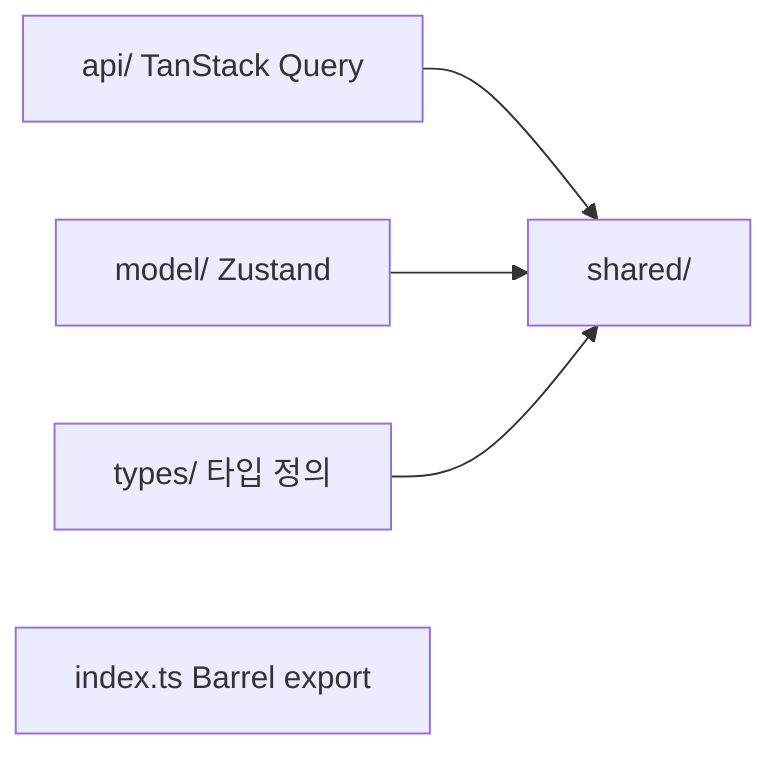
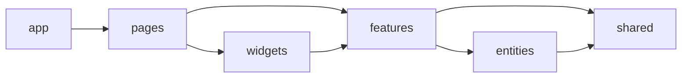
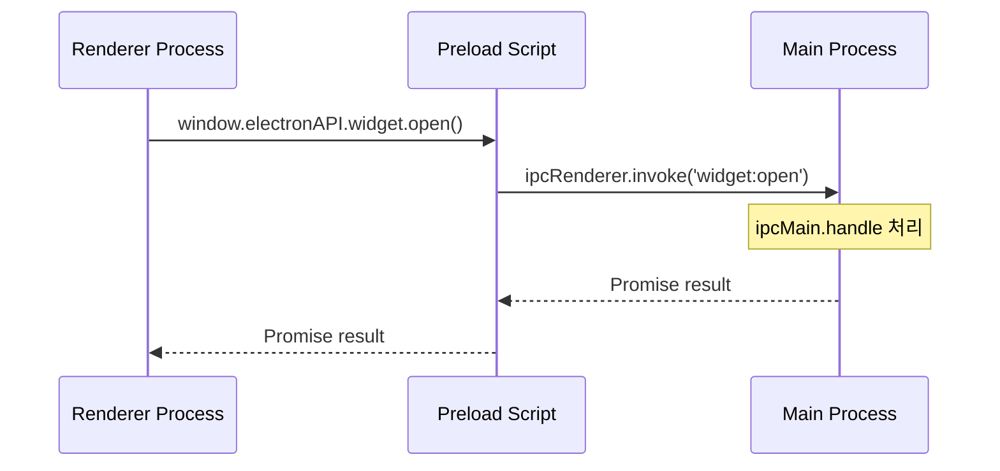

# 프로젝트 아키텍처 문서

이 문서는 프로젝트의 전체 구조와 아키텍처를 설명합니다.

## 📋 목차

1. [Electron 프로세스 구조](#electron-프로세스-구조)
2. [FSD 아키텍처 (Renderer Process)](#fsd-아키텍처-renderer-process)
3. [프로젝트 전체 구조](#프로젝트-전체-구조)
4. [레이어별 설명](#레이어별-설명)
5. [의존성 규칙](#의존성-규칙)
6. [Path Alias 설정](#path-alias-설정)
7. [프로세스 간 통신 (IPC)](#프로세스-간-통신-ipc)
8. [Assets 폴더 구조](#assets-폴더-구조)

---

## Electron 프로세스 구조

이 프로젝트는 **Electron** 데스크톱 애플리케이션으로, 다음과 같은 프로세스 구조를 가집니다:

### 프로세스 분리

```
src/
├── main/          # Main Process (Node.js 환경)
├── preload/       # Preload Scripts (보안 브리지)
└── renderer/      # Renderer Process (React 앱)
```

**프로세스 구조 다이어그램**:



**참고**: 이 구조는 **Electron의 표준 아키텍처 패턴**입니다.

- **Main Process**: 애플리케이션의 진입점, 창 관리, 시스템 API 접근
- **Preload Scripts**: 보안을 위한 Context Bridge, Main과 Renderer 간 안전한 통신
- **Renderer Process**: React 앱이 실행되는 브라우저 환경

**관련 문서**:

- [Electron 프로세스 모델](https://www.electronjs.org/docs/latest/tutorial/process-model) - **표준 프로세스 구조 설명**
- [Context Isolation](https://www.electronjs.org/docs/latest/tutorial/context-isolation) - **Preload 스크립트 사용 이유**
- [IPC 통신](https://www.electronjs.org/docs/latest/tutorial/ipc) - **프로세스 간 통신 방법**

---

## FSD 아키텍처 (Renderer Process)

Renderer Process는 **Feature-Sliced Design (FSD)** 방법론을 따릅니다.

### 레이어 구조 (하위 → 상위)

```
app → pages → widgets → features → entities → shared
```

**FSD 레이어 계층 구조**:



**의존성 규칙**: 하위 레이어는 상위 레이어에 의존할 수 없습니다.

### 핵심 원칙

1. **계층화 (Layering)**: 코드를 명확한 계층으로 분리
2. **슬라이싱 (Slicing)**: 각 계층을 기능별로 세분화
3. **세그멘테이션 (Segmentation)**: 각 슬라이스를 세그먼트로 분리

---

## 프로젝트 전체 구조

```
src/
├── main/                    # Main Process (Electron)
│   ├── src/
│   │   ├── index.ts         # 메인 프로세스 진입점
│   │   ├── mainWindow.ts    # 메인 윈도우 관리
│   │   ├── widgetWindow.ts  # 위젯 윈도우 관리
│   │   ├── notificationHandlers.ts # 알림 핸들러
│   │   ├── security-restrictions.ts # 보안 제한 설정
│   │   ├── widgetConfig.ts  # 위젯 설정
│   │   └── utils/           # 유틸리티 함수
│   ├── tsconfig.json
│   └── vite.config.js
│
├── preload/                  # Preload Scripts (Context Bridge)
│   ├── src/
│   │   ├── index.ts         # Preload 스크립트 진입점
│   │   └── sha256sum.ts     # 해시 유틸리티
│   ├── exposedInMainWorld.d.ts # 타입 정의 (자동 생성)
│   ├── tsconfig.json
│   └── vite.config.js
│
└── renderer/                 # Renderer Process (React 앱)
    ├── src/
    │   ├── app/              # 애플리케이션 초기화 및 설정
    │   │   ├── dev/         # 개발용 컴포넌트
    │   │   │   └── DevNavbar/
    │   │   ├── layouts/     # 레이아웃 컴포넌트
    │   │   │   ├── header/  # 헤더 컴포넌트
    │   │   │   └── Layout.tsx
    │   │   ├── providers/  # 전역 프로바이더
    │   │   │   └── App.tsx  # QueryClientProvider, RouterProvider
    │   │   └── main.tsx     # 애플리케이션 진입점
    │   │
    │   ├── pages/           # 페이지 컴포넌트
    │   │   ├── calibration-page/
    │   │   ├── email-verification-callback-page/
    │   │   ├── email-verification-page/
    │   │   ├── login-page/
    │   │   ├── main-page/
    │   │   ├── onboarding-completion-page/
    │   │   ├── onboarding-init-page/
    │   │   ├── onboarding-page/
    │   │   ├── resend-verification-page/
    │   │   ├── signup-page/
    │   │   └── widget-page/
    │   │
    │   ├── widgets/         # 위젯 레이어 (독립적인 UI 블록)
    │   │   ├── camera/      # 카메라 위젯
    │   │   │   └── model/   # 카메라 상태 관리
    │   │   └── widget/      # 위젯 창
    │   │       ├── lib/     # 위젯 로직
    │   │       └── ui/      # 위젯 UI 컴포넌트
    │   │
    │   ├── features/        # 기능 레이어 (비즈니스 기능)
    │   │   ├── auth/        # 인증 기능
    │   │   │   └── ui/      # 로그인, 회원가입 UI
    │   │   ├── calibration/ # 캘리브레이션 기능
    │   │   │   ├── lib/     # 캘리브레이션 로직
    │   │   │   └── ui/      # 캘리브레이션 UI
    │   │   ├── dashboard/   # 대시보드 기능
    │   │   │   ├── lib/     # 대시보드 로직
    │   │   │   └── ui/      # 대시보드 UI 컴포넌트
    │   │   ├── notification/ # 알림 기능
    │   │   │   ├── model/   # 알림 상태 관리
    │   │   │   └── ui/      # 알림 UI
    │   │   └── onboarding/  # 온보딩 기능
    │   │       └── ui/      # 온보딩 UI
    │   │
    │   ├── entities/        # 엔티티 레이어 (비즈니스 엔티티)
    │   │   ├── dashboard/   # 대시보드 엔티티
    │   │   │   ├── api/     # 대시보드 API 훅
    │   │   │   └── types/   # 대시보드 타입 정의
    │   │   ├── posture/     # 자세 분석 엔티티
    │   │   │   ├── lib/     # 자세 분석 로직
    │   │   │   └── model/   # 자세 상태 관리
    │   │   ├── session/     # 세션 엔티티
    │   │   │   ├── api/     # 세션 API 훅
    │   │   │   └── types/   # 세션 타입 정의
    │   │   └── user/        # 사용자 엔티티
    │   │       ├── api/     # 사용자 API 훅
    │   │       ├── model/   # 사용자 상태 관리
    │   │       └── types/   # 사용자 타입 정의
    │   │
    │   ├── shared/          # 공유 레이어 (공통 코드)
    │   │   ├── api/         # API 인스턴스
    │   │   │   └── instance.ts # Axios 인스턴스 및 인터셉터
    │   │   ├── config/      # 설정
    │   │   │   └── router.tsx # React Router 설정
    │   │   ├── hooks/       # 공유 훅
    │   │   │   ├── use-modal.ts
    │   │   │   └── use-theme-preference.ts
    │   │   ├── lib/         # 유틸리티 함수
    │   │   │   ├── cn.ts
    │   │   │   ├── get-color.ts
    │   │   │   └── get-score-level.ts
    │   │   ├── styles/      # 전역 스타일
    │   │   │   ├── base.css
    │   │   │   ├── breakpoint.css
    │   │   │   ├── colors.css
    │   │   │   ├── fonts.css
    │   │   │   ├── globals.css
    │   │   │   └── typography.css
    │   │   ├── types/       # 타입 정의
    │   │   │   ├── svg.d.ts
    │   │   │   └── vite-env.d.ts
    │   │   └── ui/          # 공유 UI 컴포넌트
    │   │       ├── button/
    │   │       │   ├── Button.tsx
    │   │       │   ├── buttonVariants.ts # 상수 분리 (Fast refresh 경고 방지)
    │   │       │   └── index.ts
    │   │       ├── input-field/
    │   │       ├── intensity-slider/
    │   │       ├── modal/
    │   │       ├── notification-message/
    │   │       ├── page-move-button/
    │   │       ├── panel-header/
    │   │       ├── theme-toggle-switch/
    │   │       ├── timer/
    │   │       ├── toggle-switch/
    │   │       └── typography/
    │   │
    │   └── assets/          # 정적 자산
    │       ├── auth/       # 인증 관련 아이콘
    │       ├── common/     # 공통 자산
    │       │   ├── icons/  # 공통 아이콘
    │       │   └── images/ # 공통 이미지
    │       ├── main/       # 메인 페이지 이미지
    │       ├── modal/      # 모달 캐릭터 이미지
    │       ├── onboarding/ # 온보딩 이미지
    │       ├── video/      # 비디오 파일
    │       └── widget/     # 위젯 아이콘
    │
    ├── index.html
    └── tsconfig.json
```

---

## 레이어별 설명

### Main Process (`src/main/`)

**역할**: 애플리케이션의 생명주기 관리, 창 생성 및 관리, IPC 핸들러 설정

**주요 파일**:

- `index.ts`: 메인 프로세스 진입점, IPC 핸들러 설정
- `mainWindow.ts`: 메인 윈도우 관리
- `widgetWindow.ts`: 위젯 윈도우 관리
- `notificationHandlers.ts`: 알림 핸들러
- `security-restrictions.ts`: 보안 제한 설정

**예시**:

```typescript
// src/main/src/index.ts
import { app, ipcMain } from 'electron';

ipcMain.handle('widget:open', async () => {
  // 위젯 창 열기 로직
});
```

**참고**:

- Main Process는 Node.js 환경에서 실행됩니다.
- 모든 Electron API에 접근 가능합니다.
- 이 구조는 **Electron의 표준 패턴**입니다.

**관련 문서**:

- [Electron Main Process](https://www.electronjs.org/docs/latest/tutorial/process-model#the-main-process)
- [BrowserWindow API](https://www.electronjs.org/docs/latest/api/browser-window)

---

### Preload Scripts (`src/preload/`)

**역할**: Context Bridge를 통한 안전한 API 노출, Renderer에서 Main Process로의 IPC 통신 브리지

**주요 파일**:

- `src/index.ts`: Preload 스크립트 진입점
- `exposedInMainWorld.d.ts`: 타입 정의 (자동 생성)

**예시**:

```typescript
// src/preload/src/index.ts
import { contextBridge, ipcRenderer } from 'electron';

const electronAPI = {
  widget: {
    open: () => ipcRenderer.invoke('widget:open'),
    close: () => ipcRenderer.invoke('widget:close'),
    isOpen: () => ipcRenderer.invoke('widget:isOpen'),
  },
  notification: {
    show: (title: string, body: string) =>
      ipcRenderer.invoke('notification:show', title, body),
  },
};

contextBridge.exposeInMainWorld('electronAPI', electronAPI);
```

**Renderer에서 사용**:

```typescript
// src/renderer/src/*/*.tsx
window.electronAPI.widget.open();
```

**참고**:

- Preload 스크립트는 `contextIsolation: true` 환경에서 실행됩니다.
- `exposedInMainWorld.d.ts`는 `dts-for-context-bridge`로 자동 생성됩니다.
- 이 구조는 **Electron의 보안 모범 사례**를 따릅니다.

**관련 문서**:

- [Context Isolation 가이드](https://www.electronjs.org/docs/latest/tutorial/context-isolation)
- [IPC 통신 패턴](https://www.electronjs.org/docs/latest/tutorial/ipc)
- [보안 체크리스트](https://www.electronjs.org/docs/latest/tutorial/security)

---

### Renderer Process - `app` 레이어

**역할**: 애플리케이션의 초기화, 설정, 전역 프로바이더

**구조**:

- `main.tsx`: React 앱 진입점 (ReactDOM.createRoot)
- `providers/App.tsx`: QueryClientProvider, RouterProvider
- `layouts/`: 레이아웃 컴포넌트 (Header, Layout)
- `dev/`: 개발용 컴포넌트 (DevNavbar)

**특징**:

- 다른 레이어에 의존하지 않음
- 애플리케이션의 최상위 레벨 설정만 포함

---

### Renderer Process - `pages` 레이어

**역할**: 라우트와 직접 연결되는 페이지 컴포넌트

**구조**:

- `main-page/`: 메인 대시보드 페이지
- `login-page/`: 로그인 페이지
- `signup-page/`: 회원가입 페이지
- `calibration-page/`: 캘리브레이션 페이지
- `widget-page/`: 위젯 페이지
- `onboarding-page/`: 온보딩 페이지
- 기타 인증 관련 페이지들

**특징**:

- 여러 `features`를 조합하여 페이지 구성
- 라우터 설정과 직접 연결됨

---

### Renderer Process - `widgets` 레이어

**역할**: 독립적으로 동작하는 재사용 가능한 UI 블록

**구조**:

- `camera/`: 카메라 상태 관리 위젯
- `widget/`: 위젯 창 UI 및 로직

**특징**:

- 독립적으로 동작 가능
- 여러 페이지에서 재사용 가능
- 자체 상태 관리 포함 가능

---

### Renderer Process - `features` 레이어

**역할**: 완전한 비즈니스 기능을 구현

**구조**:

- `auth/`: 인증 기능 (로그인, 회원가입, 이메일 인증)
- `calibration/`: 캘리브레이션 기능
- `dashboard/`: 대시보드 기능 (통계, 그래프, 패널 등)
- `notification/`: 알림 기능
- `onboarding/`: 온보딩 기능

**Feature 구조 다이어그램**:



**각 feature의 구조**:

```
feature-name/
├── ui/          # UI 컴포넌트
├── lib/         # 비즈니스 로직 (선택)
├── model/       # 상태 관리 (선택)
└── index.ts     # Barrel export
```

**특징**:

- 하나의 완전한 비즈니스 기능을 포함
- `entities`와 `shared`를 사용하여 구현
- 다른 `features`에 직접 의존하지 않음

---

### Renderer Process - `entities` 레이어

**역할**: 비즈니스 엔티티를 정의하고 관리

**구조**:

- `dashboard/`: 대시보드 데이터 및 API
- `posture/`: 자세 분석 엔티티 (분류, 계산, 시각화)
- `session/`: 세션 관리 엔티티
- `user/`: 사용자 엔티티 (인증, 회원가입)

**Entity 구조 다이어그램**:



**각 entity의 구조**:

```
entity-name/
├── api/         # API 훅 (TanStack Query)
├── model/       # 상태 관리 (Zustand)
├── types/       # 타입 정의
└── index.ts     # Barrel export
```

**특징**:

- 비즈니스 로직의 핵심
- 여러 `features`에서 재사용됨
- `shared`만 의존 가능

---

### Renderer Process - `shared` 레이어

**역할**: 프로젝트 전반에서 공유되는 코드

**구조**:

- `api/`: Axios 인스턴스 및 인터셉터
- `config/`: 설정 파일 (라우터 등)
- `hooks/`: 공유 훅
- `lib/`: 유틸리티 함수
- `styles/`: 전역 스타일
- `types/`: 공유 타입 정의
- `ui/`: 공유 UI 컴포넌트

**특징**:

- 프로젝트 전반에서 사용됨
- 다른 레이어에 의존하지 않음
- 프레임워크나 라이브러리 래퍼 포함 가능

**참고**: Fast Refresh 경고를 방지하기 위해 상수는 별도 파일로 분리합니다.

- 예: `shared/ui/button/buttonVariants.ts`

---

## 의존성 규칙

### 허용되는 의존성

```
app → pages → widgets → features → entities → shared
```

**의존성 규칙 다이어그램**:



- **하위 레이어는 상위 레이어에 의존 가능**
- **상위 레이어는 하위 레이어에 의존 불가**

### 예시

✅ **허용**:

- `features/dashboard` → `entities/posture` ✅
- `features/dashboard` → `shared/ui/button` ✅
- `pages/main-page` → `features/dashboard` ✅

❌ **금지**:

- `entities/posture` → `features/dashboard` ❌
- `shared/lib` → `entities/user` ❌
- `features/auth` → `features/dashboard` ❌

---

## Path Alias 설정

### TypeScript (`tsconfig.json`)

```json
{
  "compilerOptions": {
    "baseUrl": "./src",
    "paths": {
      "@shared/*": ["./shared/*"],
      "@entities/*": ["./entities/*"],
      "@features/*": ["./features/*"],
      "@widgets/*": ["./widgets/*"],
      "@assets/*": ["./assets/*"]
    }
  }
}
```

### Vite (`vite.config.mts`)

```typescript
resolve: {
  alias: {
    '@shared/': path.resolve(__dirname, 'src/renderer/src/shared') + '/',
    '@entities/': path.resolve(__dirname, 'src/renderer/src/entities') + '/',
    '@features/': path.resolve(__dirname, 'src/renderer/src/features') + '/',
    '@widgets/': path.resolve(__dirname, 'src/renderer/src/widgets') + '/',
    '@assets/': path.resolve(__dirname, 'src/renderer/src/assets') + '/',
  }
}
```

### 사용 예시

```typescript
// ✅ 좋은 예시
import { Button } from '@shared/ui/button';
import { usePostureStore } from '@entities/posture';
import { LoginPage } from '@features/auth';
import { useWidget } from '@widgets/widget';
import Logo from '@assets/common/icons/logo.svg?react';

// ❌ 나쁜 예시 (상대 경로)
import { Button } from '../../../shared/ui/button';
```

---

## 프로세스 간 통신 (IPC)

### Main ↔ Renderer 통신 패턴

이 프로젝트는 Electron의 표준 IPC 패턴을 사용합니다:

1. **Renderer → Main**: `ipcRenderer.invoke()` 사용
2. **Main → Renderer**: `webContents.send()` 사용 (필요시)
3. **Preload**: Context Bridge를 통한 안전한 API 노출

**IPC 통신 흐름도**:



**예시 흐름**:

```
Renderer Process          Preload Script          Main Process
     │                         │                       │
     │  window.electronAPI     │                       │
     │  .widget.open()         │                       │
     ├────────────────────────>│                       │
     │                         │  ipcRenderer.invoke   │
     │                         │  ('widget:open')      │
     │                         ├───────────────────────>│
     │                         │                       │  ipcMain.handle
     │                         │                       │  ('widget:open')
     │                         │                       │  처리
     │                         │<───────────────────────┤
     │                         │  Promise<result>      │
     │<────────────────────────┤                       │
     │  Promise<result>        │                       │
```

**보안 고려사항**:

- ✅ Context Isolation 활성화
- ✅ Node.js 통합 비활성화 (Renderer)
- ✅ Preload를 통한 제한된 API만 노출
- ✅ 모든 IPC 핸들러에서 입력 검증

**관련 문서**:

- [IPC 통신 가이드](https://www.electronjs.org/docs/latest/tutorial/ipc)
- [보안 가이드](https://www.electronjs.org/docs/latest/tutorial/security)

---

## 세그먼트 (Segment)

각 레이어의 슬라이스는 다음 세그먼트로 구성될 수 있습니다:

- **`ui/`**: UI 컴포넌트
- **`lib/`**: 비즈니스 로직 및 유틸리티
- **`model/`**: 상태 관리 (Zustand store 등)
- **`api/`**: API 호출 (TanStack Query hooks)
- **`types/`**: 타입 정의
- **`config/`**: 설정 파일

### Barrel Export (`index.ts`)

각 슬라이스와 레이어는 `index.ts`를 통해 public API를 제공합니다:

```typescript
// entities/posture/index.ts
export * from './lib';
export * from './model';
export type { PoseLandmark, WorldLandmark } from './lib/types';
```

이를 통해 깔끔한 import가 가능합니다:

```typescript
import { usePostureStore, PostureClassifier } from '@entities/posture';
```

---

## Import Best Practices

### 1. Path Alias 사용

```typescript
// ✅ 좋은 예시
import { Button } from '@shared/ui/button';
import { usePostureStore } from '@entities/posture';
import { LoginPage } from '@features/auth';

// ❌ 나쁜 예시
import { Button } from '../../../shared/ui/button';
```

### 2. Barrel Export 활용

```typescript
// ✅ 좋은 예시: Barrel export 사용
import {
  usePostureStore,
  PostureClassifier,
  type PoseLandmark,
} from '@entities/posture';
```

### 3. 타입 Import 분리

```typescript
// ✅ 좋은 예시: 타입과 값 분리
import { usePostureStore } from '@entities/posture';
import type { PoseLandmark, WorldLandmark } from '@entities/posture';
```

---

## 참고 자료

### FSD 관련

- [Feature-Sliced Design 공식 문서](https://feature-sliced.design/)
- [FSD Best Practices](https://feature-sliced.design/docs/get-started/overview)
